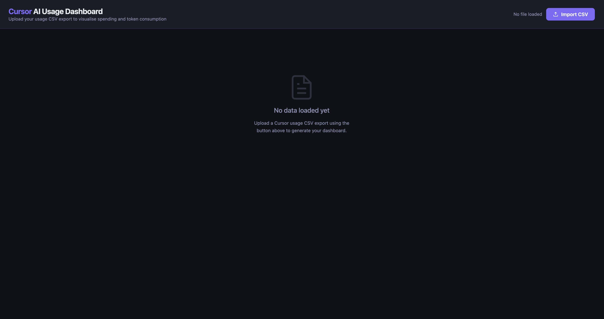
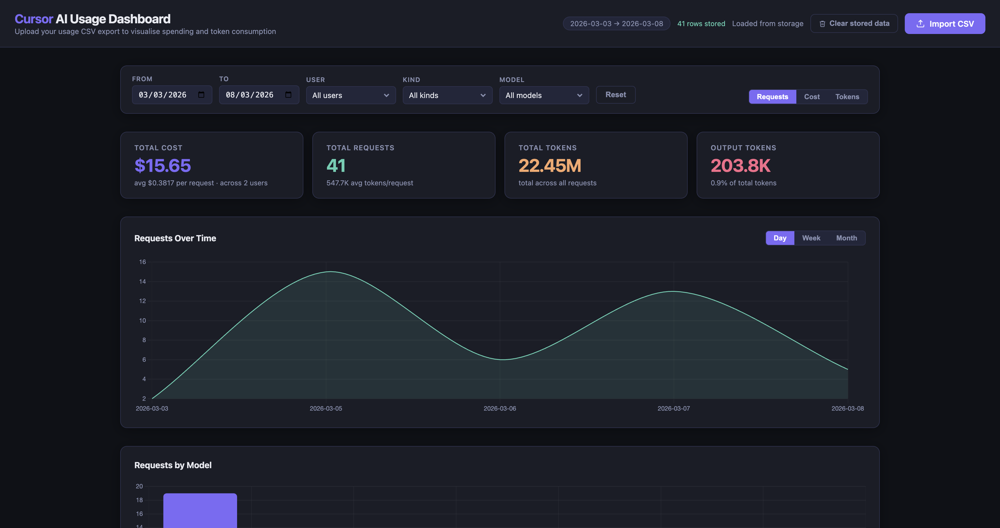

# Cursor AI Usage Dashboard

A single-file web application for visualizing Cursor AI usage data, spending, and token consumption. Upload your CSV export to generate interactive charts, filter by date range/users/models, and analyze your AI usage patterns.

## Features

- **CSV Import/Export**: Upload your Cursor usage CSV files and export filtered data
- **Interactive Charts**: 
  - Time series charts showing cost, requests, or tokens over time
  - Model breakdown bar charts
  - Token component breakdown (when viewing tokens metric)
  - Adjustable granularity (day/week/month)
- **KPI Cards**: Quick overview of total cost, requests, tokens, and output tokens
- **Advanced Filtering**: 
  - Date range filtering
  - Multi-select filters for users, kinds, and models
  - Cascading filter options (filters update based on other selections)
  - Metric toggle (Requests/Cost/Tokens)
- **Data Persistence**: Automatically stores data in browser IndexedDB for persistence across sessions
- **Responsive Design**: Modern dark theme UI that works on desktop and mobile
- **Data Table**: Sortable, paginated table with all raw data that can be exported in filtered state
- **Flexible CSV Support**: Works with CSVs that include or exclude the User column

## Screenshots

### Empty State

The dashboard starts with a clean interface, prompting you to upload your CSV file.

### Dashboard with Data Loaded

Once data is loaded, you'll see:
- KPI cards showing totals and averages
- Filter bar with date range and multi-select dropdowns
- Interactive time series chart
- Model breakdown chart
- Full data table with pagination

## Quick Start

1. **Download or clone this repository**
2. **Open `index.html` in your web browser** (no server required!)
3. **Click "Import CSV"** and select your Cursor usage export file
4. **Explore your data** using the filters and charts

That's it! The dashboard is completely self-contained and runs entirely in your browser.

## Usage Guide

### Uploading Data

1. Export your usage data from Cursor (Settings → Usage → Export)
2. Click the "Import CSV" button in the dashboard header
3. Select your CSV file
4. The dashboard will automatically parse and display your data

### Filtering Data

- **Date Range**: Use the "From" and "To" date pickers to filter by date
- **User Filter**: Select specific users (if your CSV includes user data)
- **Kind Filter**: Filter by request kind (e.g., "Included", "Errored, No Charge")
- **Model Filter**: Filter by AI model (e.g., "claude-4.6-sonnet-medium-thinking", "composer-1")
- **Reset Button**: Clear all filters and return to full dataset

Filters cascade automatically - selecting a date range will update available options in other filters.

### Viewing Metrics

Toggle between three metrics using the buttons in the filter bar:
- **Requests**: Count of API requests over time
- **Cost**: Total cost in USD over time
- **Tokens**: Token consumption over time (shows component breakdown)

### Time Granularity

For time series charts, adjust granularity:
- **Day**: Daily aggregation
- **Week**: Weekly aggregation (ISO weeks)
- **Month**: Monthly aggregation

### Exporting Filtered Data

1. Apply your desired filters
2. Click the "Export CSV" button above the data table
3. A CSV file will download with your filtered data

### Clearing Stored Data

If you've stored data in the browser, you can clear it:
1. Click "Clear stored data" in the header
2. Confirm the action
3. All stored data will be removed

## CSV Format

The dashboard expects CSV files exported from Cursor with the following columns:

### Required Columns
- `Date` - Timestamp of the request
- `Kind` - Request type (e.g., "Included", "Errored, No Charge")
- `Model` - AI model used (e.g., "claude-4.6-sonnet-medium-thinking")
- `Max Mode` - Whether max mode was used
- `Input (w/ Cache Write)` - Input tokens with cache write
- `Input (w/o Cache Write)` - Input tokens without cache write
- `Cache Read` - Tokens read from cache
- `Output Tokens` - Output tokens generated
- `Total Tokens` - Total tokens used
- `Cost` - Cost in USD

### Optional Columns
- `User` - User identifier (if your CSV includes user data, the dashboard will show user filters)

See `examples/sample_data.csv` for an example CSV file with the User column included.

The dashboard automatically detects whether your CSV includes the User column and adapts accordingly.

## Technical Details

### Libraries Used

This dashboard uses the following open-source libraries (loaded via CDN):

- **[Chart.js](https://www.chartjs.org/)** (v4.4.3) - For interactive charts
- **[Chart.js Date Adapter](https://github.com/chartjs/chartjs-adapter-date-fns)** (v3.0.0) - For date handling in charts
- **[Tabulator](https://tabulator.info/)** (v6.2.1) - For the data table
- **[Papa Parse](https://www.papaparse.com/)** (v5.4.1) - For CSV parsing and export

### Data Storage

- **IndexedDB**: Data is stored locally in your browser using IndexedDB
- **localStorage**: Filter preferences and settings are saved in localStorage
- **No Server**: All processing happens client-side - your data never leaves your browser

### Browser Compatibility

Requires a modern browser with support for:
- ES6 JavaScript features
- IndexedDB API
- Canvas API (for charts)

Tested and works in:
- Chromium-based Browsers (latest)

## Contributing

Contributions are welcome! Please feel free to submit issues or pull requests.

## License

This project is licensed under the GNU General Public License v3.0 - see the [LICENSE](LICENSE) file for details.
